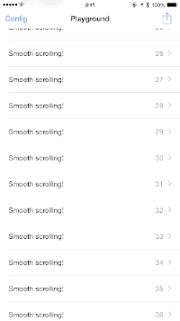
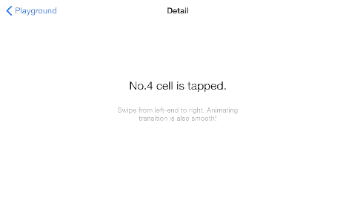
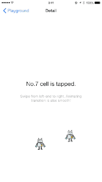
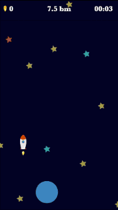

# 

TouchVisualizer for Cordova is a native (iOS only) implementation for visualising touches on the screen.

# Cordova Touch Visualizer

This is a Cordova Plugin wrapper around the original Touch Visualizer for iOS (swift). Most of the work has been done by these awsome people. Thanks! [TouchVisualizer](https://github.com/morizotter/TouchVisualizer) 

## Features
- Works with just **a single line of code**!
- Supports multiple fingers.
- Supports multiple `UIWindow`'s.
- Displays touch radius (finger size).
- Displays touch duration.
- Customise the finger-points colour.
- Supports iPhone and iPad in both portrait and landscape mode.

## How it looks
### Portrait:

### Landscape:

### Robots:

### In-app implementation:


It's fun!

## Runtime Requirements

- Cordova
- Swift 4.0
- Xcode 9.2
- iOS9.0 or later

TouchVisualizer works with Swift 4 

## Installation and Setup
**Note:** Embedded frameworks require a minimum deployment target of iOS 9.0.

**Information:** To use TouchVisualizer with a project targeting iOS 8.0 or lower, you must include the `TouchVisualizer.swift` source file directly in your project.

```
cordova plugin add cordova-plugin-touch-visualizer
``` 


## Usage

To start using TouchVisualizer, write the following line wherever you want to start visualising:

```javascript
    let config = {
				hexRGBAColor: "#0000ffff",
				showsTimer: true,
				showsTouchRadius: true,
				showsLog: true
			}
    TouchVisualizer.start(config, (success) => {
        console.log("success visualizer", success)
    }, (error) => {
        console.log("error visualizer", error)
    });
```

and stop the presentation like this:

```javascript
    TouchVisualizer.stop((success) => {
        console.log("success visualizer stop", success)
    }, (error) => {
        console.log("error visualizer stop", error)
    });
```

It is really simple, isn't it?

### Peripheral

- [How to take an iOS screen movie](misc/take_a_movie.md)

### Presentation

- [TouchVisualizer Demo movie #potatotips // Speaker Deck](https://speakerdeck.com/morizotter/touchvisualizer-demo-movie-number-potatotips) @potatotips May 13 2015

## Android
Android ships already with this feature (without customization). If you wonna have it customized don't hesitate to contribute.

## Contributing

Please file issues or submit pull requests for anything you’d like to see! We're waiting! :)
[See how to enable it on Android](https://medium.theuxblog.com/enabling-show-touches-in-android-screen-recordings-for-user-research-cc968563fcb9)

## Licensing
TouchVisualizer is released under the MIT license. Go read the LICENSE file for more information.
